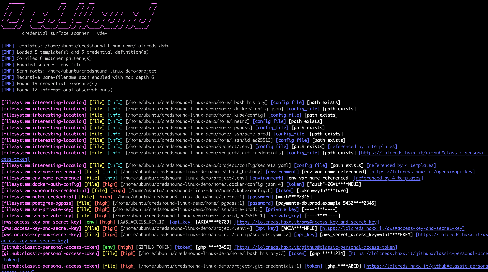
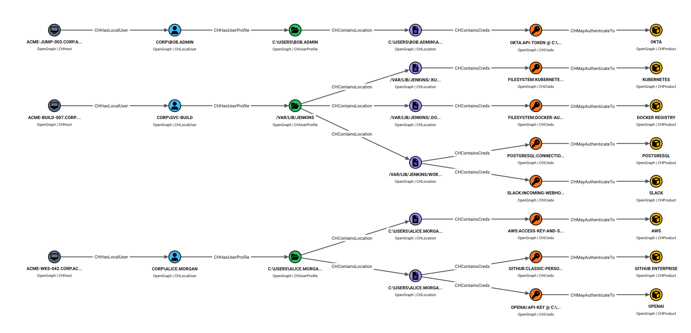

# CredsHound

CredsHound is a lightweight, data-driven credential surface scanner written in Go. It audits local hosts for exposed or forgotten application credentials, session tokens, API keys, and configuration secrets.

It uses [LOLCreds](https://lolcreds.haxx.it/) template data for product-aware checks and ships with a built-in set of high-performance, vendor-neutral checks. Beyond classic cloud and DevOps artifacts, CredsHound is fully optimized for modern environments, target-scanning everything from DBeaver encrypted databases to AI-agent setups (OpenCode, GitHub Copilot CLI, Hugging Face, OpenAI).

---

### 📸 Demo
#### CLI Output



#### Attack Path Mapping in BloodHound


---

## ⚡ What It Checks

* **Environment variables** (scanning running process environment for exposed keys).
* **Linux process environments** via `/proc/*/environ` when explicitly enabled.
* **Configuration files** and project-local configs.
* **Common credential artifacts** such as Git credentials, Docker auth config, kubeconfig, shell history (`.bash_history`, `.zsh_history`, PowerShell history), `.netrc`, `.pgpass`, private keys, and similar files.

---

## 🐶 BloodHound Integration (`-bh` / `-bloodhound`)

Instead of throwing messy text logs at you, CredsHound can map local exposures directly into graph-compatible JSON.

When imported into BloodHound, it visualizes the exact blast radius of a compromised host or build server:

```text
CHHost ➔ CHLocalUser ➔ CHUserProfile ➔ CHLocation ➔ CHCreds ➔ CHProduct
```

See [BloodHound integration docs](docs/integrations/bloodhound.md) for import notes, graph model details, useful Cypher queries, and optional icon guidance.

## 📥 Install

With Go installed:

```bash
go install github.com/haxxm0nkey/credshound/cmd/credshound@latest
```

Or build locally:

```bash
go build -o credshound ./cmd/credshound
```

## 🗂️ Templates

CredsHound uses LOLCreds data from:

```text
https://github.com/haxxm0nkey/lolcreds-data
```

Download/update templates:

```bash
credshound -ut
```

Offline scan with a downloaded zip:

```bash
credshound -t /path/to/lolcreds-data-main.zip .
```

Use a local templates directory:

```bash
credshound -t ~/lolcreds-templates .
```

## ⚙️ Usage

Scan the current directory plus host-level default locations:

```bash
credshound .
```

Scan multiple roots:

```bash
credshound ~/project /etc
```

Recursively search roots for bare config filenames such as `.env` or `values.yaml`:

```bash
credshound -recursive .
```

Scan only environment variables:

```bash
credshound -sources env
```

Scan current and process environment variables on Linux:

```bash
credshound -sources env,proc
```

Filter findings by ID, severity, type, or origin:

```bash
credshound -severity high -type api_key,token .
credshound -id github,openai:api-key .
credshound -eid process:environment-variable -origin template,builtin .
```

Write JSONL:

```bash
credshound -silent -j -o findings.jsonl .
```

Write BloodHound OpenGraph JSON:

```bash
credshound -bloodhound -o credshound-bloodhound.json .
```

Inspect template coverage:

```bash
credshound inspect-templates -t ~/lolcreds-templates
```

## Output

By default, CLI outputs are colorized and resemble Nuclei results:

```text
[github:classic-personal-access-token] [file] [high] [/home/alice/.git-credentials:1] [token] [ghp_****abcd] [https://lolcreds.haxx.it/github#classic-personal-access-token]
```

🔒 Security Notice: Findings are redacted by default. Use the `-show-secrets` flag only when you explicitly need full plaintext values and can guarantee the security of your output destination.

## 💻 Development

Run tests:

```bash
go test ./...
```

Cross-compile sanity check:

```bash
GOOS=windows GOARCH=amd64 go test -exec=/usr/bin/true ./...
```

## ⚠️ Safety

CredsHound is intended for defensive auditing of systems you own or are authorized to
assess. It can reveal sensitive local data. Treat scan output as confidential.
